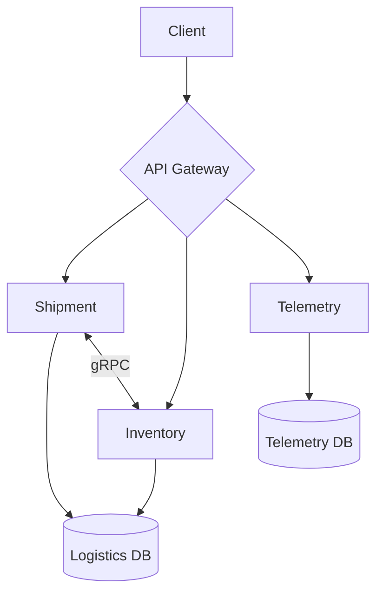
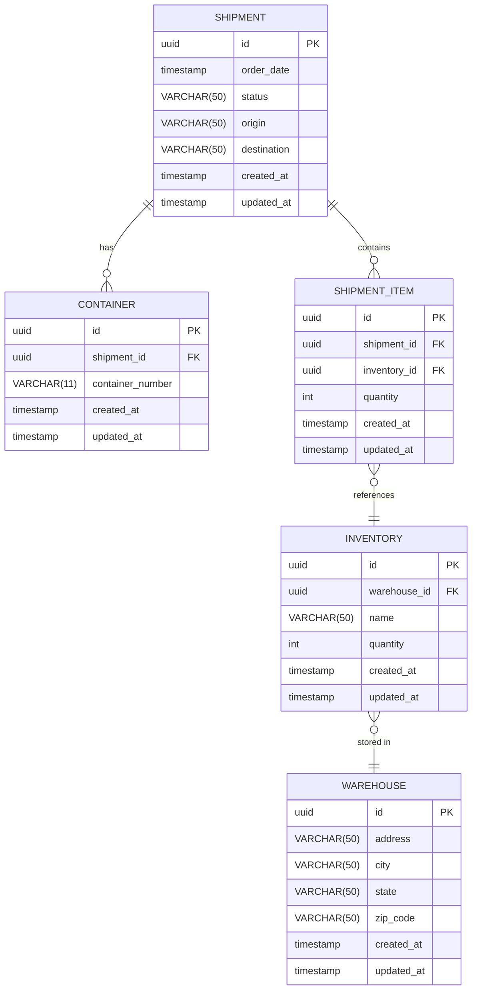
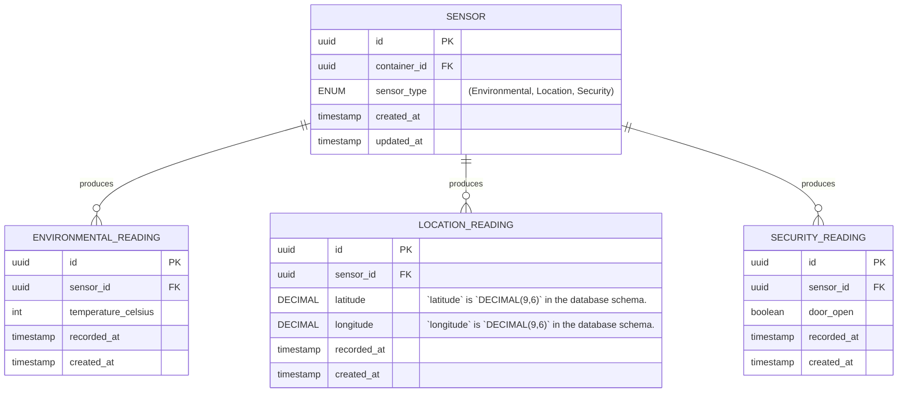

# Architecture Overview

This repository contains source code for a logistics platform built to demonstrate
a production-style microservices architecture using Go, Docker, and Kubernetes. It
consists of three domain services—shipment, inventory, and telemetry—behind an
API gateway, reflecting how real supply chain systems separate these concerns.

## Project Structure

```text
├── api/ # generated using `swag`, and contains API documentation
├── cmd/ # contains each application's entrypoint file
│   ├── gateway/main.go
│   ├── inventory/main.go
│   ├── shipment/main.go
│   └── telemetry/main.go
├── internal/          # domain logic, handlers, and middleware (not importable externally)
│   ├── gateway/
│   ├── shipment/
│   ├── inventory/
│   └── telemetry/
├── manifests/
│   ├── Dockerfile          # single Dockerfile for all services, parameterized by SERVICE build arg
│   ├── docker-compose.yaml # local development orchestration
│   ├── gateway/            # Kubernetes manifests
│   ├── inventory/          # Kubernetes manifests
│   ├── shipment/           # Kubernetes manifests
│   └── telemetry/          # Kubernetes manifests
├── migrations
│   ├── Makefile # Makefile for running migrations
│   ├── logistics
│   └── telemetry
│
├── ARCHITECTURE.md # This document
├── LICENSE # license
├── Makefile # Makefile for running tasks for development and deployment
└── README.md # Project overview and guide
```

## Services

This section documents each service to some depth.

### Shipment

The Shipment service owns the creation of shipments, status transitions, and route
information.

- Database: PostgreSQL – shipments are relational by nature, a shipment has a
  status history, waypoints, and references inventory items
- gRPC: Receives calls from Inventory when a shipment status changes to update
  stock levels; calls Inventory when a shipment is created to verify stock
  availability.

#### Endpoints

| Method | Path                            | Description                 |
| ------ | ------------------------------- | --------------------------- |
| GET    | `/health`                       | Health check                |
| GET    | `/api/v1/shipments`             | List all shipments          |
| POST   | `/api/v1/shipments`             | Create a shipment           |
| GET    | `/api/v1/shipments/{id}`        | Get a shipment by ID        |
| PUT    | `/api/v1/shipments/{id}`        | Update a shipment           |
| DELETE | `/api/v1/shipments/{id}`        | Delete a shipment           |
| GET    | `/api/v1/shipments/{id}/status` | Get shipment status history |

### Inventory

The inventory service owns the item catalog, stock levels, and warehouse
locations.

- Database: PostgreSQL – inventory is inherently relational, items have
  categories, locations, and stock thresholds
- gRPC: calls Shipment to update inventory when a shipment status changes;
  responds to Shipment when stock availability is checked

#### Endpoints

| Method | Path                       | Description          |
| ------ | -------------------------- | -------------------- |
| GET    | `/health`                  | Health check         |
| GET    | `/api/v1/items`            | List all items       |
| POST   | `/api/v1/items`            | Create an item       |
| GET    | `/api/v1/items/{id}`       | Get an item by ID    |
| PUT    | `/api/v1/items/{id}`       | Update an item       |
| DELETE | `/api/v1/items/{id}`       | Delete an item       |
| PUT    | `/api/v1/items/{id}/stock` | Adjust stock level   |
| GET    | `/api/v1/items/low-stock`  | List low stock items |

### Telemetry

The Telemetry service owns sensor reading data attached to shipments:
temperature, humidity, GPS coordinates, etc.

- Database: PostgreSQL – chosen for operational simplicity; a production system
  might use TimescaleDB or InfluxDB for time-series query performance at scale
- No gRPC—telemetry is write-heavy and read-only from other services'
  perspective, no service-to-service calls needed (in V1).

#### Endpoints

| Method | Path                                    | Description                       |
| ------ | --------------------------------------- | --------------------------------- |
| GET    | `/health`                               | Health check                      |
| GET    | `/api/v1/readings`                      | Query readings by time range      |
| POST   | `/api/v1/readings`                      | Ingest a sensor reading           |
| GET    | `/api/v1/readings/{shipment_id}`        | Get readings by shipment ID       |
| GET    | `/api/v1/readings/{shipment_id}/latest` | Get latest reading for a shipment |

## Gateway

The API Gateway is the single entry point for all external traffic, responsible
for rate limiting, logging, tracing, JWT validation, and load balancing.

The gateway is implemented in three stages:

1. Rate Limiting and logging/tracing
2. JWT Validation
3. Load Balancing

Each stage is developed independently so the gateway is functional and
deployable before all features are complete.

## System Diagram



## Data Model

This section shows the Architecture diagram for both the Logistics database and
the Telemetry database.

### Logistics



### Telemetry




## API Design Principles

1. **REST externally**, gRPC internally — all client-facing endpoints are REST;
   Shipment and Inventory communicate over gRPC because service-to-service
   calls benefit from strongly typed contracts and lower latency than JSON over
   HTTP.

2. **All external traffic enters through the gateway** — services are not
   directly accessible, the gateway is the only public entry point.

3. **Versioning from day one** — all endpoints are prefixed with `/api/v1` so
   breaking changes can be introduced under `/api/v2` without affecting existing
   clients.
