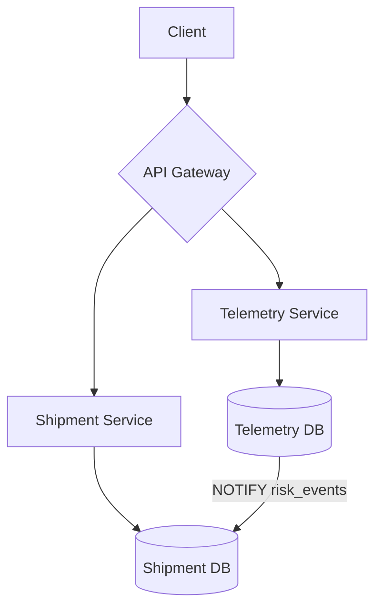
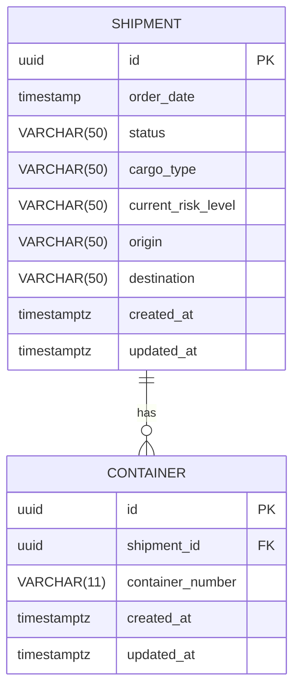
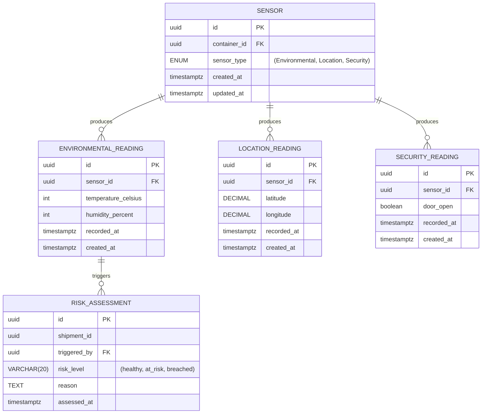

# Architecture Overview

This repository contains source code for a supply chain risk intelligence platform
built to demonstrate a production-style microservices architecture using Go, Docker,
and Kubernetes. It consists of two domain services—shipment and telemetry—behind an
API gateway, reflecting how real supply chain systems separate operational and
observability concerns.

The platform is domain-modeled after the class of problems solved by data-powered
cargo insurers: sensor readings from goods in transit are continuously evaluated
against cargo-type thresholds, producing an immutable audit trail of risk assessments
that drive shipment risk state in real time.

## Project Structure

```text
├── api/                # generated using `swag`, contains API documentation
├── cmd/                # application entrypoints
│   ├── gateway/main.go
│   ├── shipment/main.go
│   └── telemetry/main.go
├── internal/           # domain logic, handlers, and middleware (not importable externally)
│   ├── gateway/
│   ├── shipment/
│   └── telemetry/
├── manifests/
│   ├── compose.yaml        # local development orchestration
│   ├── gateway/            # Dockerfile + Kubernetes manifests
│   ├── shipment/           # Dockerfile + Kubernetes manifests
│   └── telemetry/          # Dockerfile + Kubernetes manifests
├── migrations/
│   ├── Makefile            # Makefile for running migrations
│   ├── shipment/           # shipment schema
│   └── telemetry/          # sensor readings + risk assessments schema
├── ARCHITECTURE.md         # this document
├── LICENSE
├── Makefile                # tasks for development and deployment
└── README.md               # project overview and setup guide
```

## Services

### Shipment

The Shipment service owns the creation of shipments, lifecycle status transitions,
and cargo metadata. It acts as the domain anchor for the risk pipeline — a
shipment's `cargo_type` determines which thresholds the telemetry service evaluates
readings against, and its `current_risk_level` reflects the latest risk assessment
produced downstream.

- **Database:** PostgreSQL — shipments are relational by nature, with status history
  and structured cargo metadata.
- **Risk state:** Shipment risk level is updated asynchronously via Postgres
  `LISTEN/NOTIFY` when the telemetry service produces a new risk assessment.

#### Endpoints

| Method | Path                            | Description                 |
| ------ | ------------------------------- | --------------------------- |
| GET    | `/health`                       | Health check                |
| GET    | `/api/v1/shipments`             | List all shipments          |
| POST   | `/api/v1/shipments`             | Create a shipment           |
| GET    | `/api/v1/shipments/{id}`        | Get a shipment by ID        |
| PUT    | `/api/v1/shipments/{id}`        | Update a shipment           |
| DELETE | `/api/v1/shipments/{id}`        | Delete a shipment           |
| GET    | `/api/v1/shipments/{id}/status` | Get shipment status history |

---

### Telemetry

The Telemetry service owns sensor reading ingestion and risk evaluation. It is the
core of the platform. On every ingest, it evaluates the incoming reading against
the cargo-type thresholds for the associated shipment, writes an immutable risk
assessment record if a threshold is breached, and notifies the shipment service
via Postgres `NOTIFY`.

The decision to keep risk evaluation inside the telemetry service — rather than a
separate risk service — reflects a deliberate V1 tradeoff: telemetry owns the data,
so co-locating the evaluation avoids a network hop and keeps the consistency boundary
simple. This is revisited in the ADRs.

- **Database:** PostgreSQL — chosen for operational simplicity and native
  `LISTEN/NOTIFY` support. A production system at scale would evaluate TimescaleDB
  or InfluxDB for time-series query performance.
- **Event log:** Risk assessments are append-only. Records are never updated,
  only inserted. This preserves the full audit trail of when and why a shipment's
  risk state changed — which carries significance in insurance contexts where the
  timestamp of a loss event is legally meaningful.
- **No gRPC:** Telemetry is write-heavy; other services consume its output
  asynchronously via Postgres notifications rather than synchronous RPC calls.

#### Endpoints

| Method | Path                                    | Description                       |
| ------ | --------------------------------------- | --------------------------------- |
| GET    | `/health`                               | Health check                      |
| POST   | `/api/v1/readings`                      | Ingest a sensor reading           |
| GET    | `/api/v1/readings`                      | Query readings by time range      |
| GET    | `/api/v1/readings/{shipment_id}`        | Get all readings for a shipment   |
| GET    | `/api/v1/readings/{shipment_id}/latest` | Get latest reading for a shipment |
| GET    | `/api/v1/readings/{shipment_id}/risk`   | Get risk assessment history       |

---

## Gateway

The API Gateway is the single entry point for all external traffic, responsible
for rate limiting, structured logging, tracing, JWT validation, and reverse proxying
to upstream services.

The gateway is implemented in three stages, each independently deployable:

1. Rate limiting and logging/tracing
2. JWT validation
3. Load balancing

---

## System Diagram



---

## Data Model

### Shipment DB

The Shipment schema is intentionally lean. The shipment record serves as the
domain anchor — cargo type drives threshold evaluation in the telemetry service,
and current risk level is the materialized output of the latest risk assessment.



---

### Telemetry DB

Sensors are attached to containers and produce typed readings. After each ingest,
readings are evaluated against cargo-type thresholds. Breaches produce a
`risk_assessment` record — the immutable audit log of all risk decisions.



> `latitude` and `longitude` use `DECIMAL(9,6)` precision in the schema.

---

## Risk Evaluation

Threshold configuration is cargo-type-driven. Each cargo type defines acceptable
bounds for environmental readings:

| Cargo Type     | Min Temp (°C) | Max Temp (°C) |
| -------------- | ------------- | ------------- |
| pharmaceutical | 2             | 8             |
| perishable     | 0             | 4             |
| ambient        | -10           | 35            |

On every ingest to `POST /api/v1/readings`, the telemetry service:

1. Persists the raw reading
2. Fetches the shipment's `cargo_type` via the logistics DB
3. Evaluates the reading against the threshold table
4. If breached, writes a `RISK_ASSESSMENT` record and emits a Postgres `NOTIFY` on the `risk_events` channel
5. The shipment service `LISTEN`s on `risk_events` and updates `current_risk_level` on the shipment record

This keeps the consistency boundary within a single write path while decoupling
the shipment service from synchronous dependency on telemetry.

---

## API Design Principles

1. **REST externally, async internally** — all client-facing endpoints are REST;
   cross-service communication uses Postgres `LISTEN/NOTIFY` to avoid synchronous
   coupling.

2. **Immutable event log for risk** — risk assessments are append-only. The audit
   trail is never modified, only extended.

3. **All external traffic enters through the gateway** — services are not directly
   accessible; the gateway is the only public entry point.

4. **Versioning from day one** — all endpoints are prefixed with `/api/v1` so
   breaking changes can be introduced under `/api/v2` without affecting existing
   clients.

5. **Cargo type as the risk contract** — the shipment's `cargo_type` is the
   interface between the logistics and telemetry domains. It is the only field
   the telemetry service reads from the logistics DB, keeping cross-domain
   coupling minimal.
