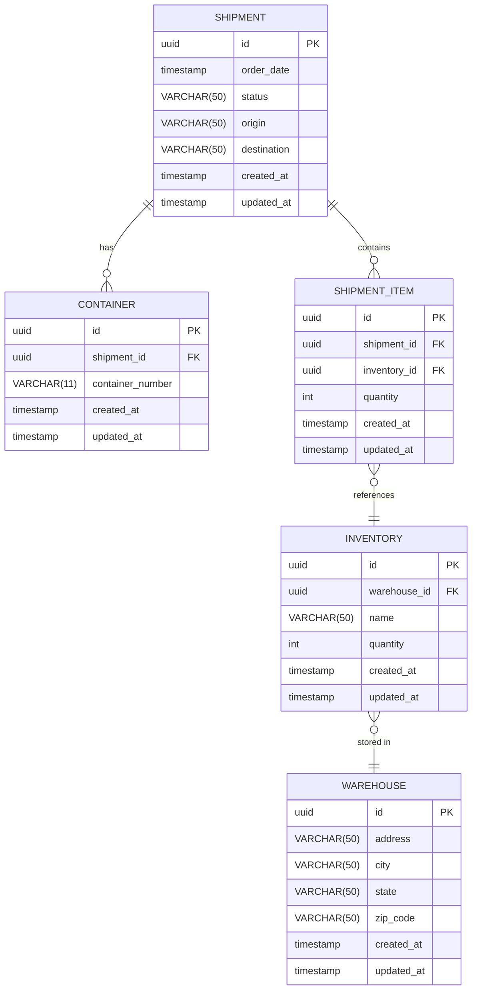
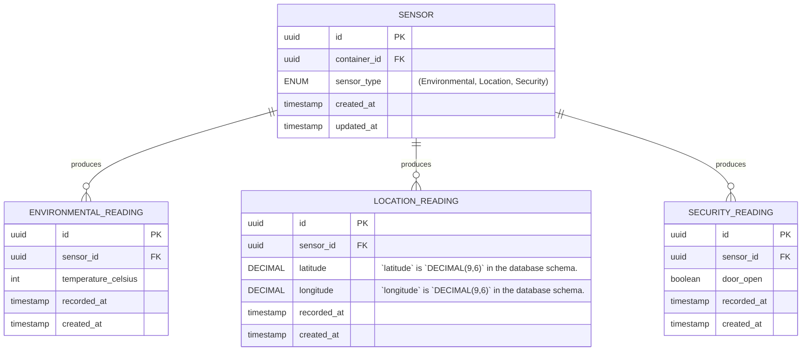

## Services

This section documents each service's data model to some depth.

### Shipment

The Shipment service owns the creation of shipments, status transitions, and route
information.

- Database: PostgreSQL – shipments are relational by nature, a shipment has a
  status history, waypoints, and references inventory items
- gRPC: Receives calls from Inventory when a shipment status changes to update
  stock levels; calls Inventory when a shipment is created to verify stock
  availability.

### Inventory

The inventory service owns the item catalog, stock levels, and warehouse
locations. 

- Database: PostgreSQL – inventory is inherently relational, items have
  categories, locations, and stock thresholds
- gRPC: calls Shipment to update inventory when a shipment status changes;
  responds to Shipment when stock availability is checked

#### Data Model

### Telemetry

The Telemetry service owns sensor reading data attached to shipments:
temperature, humidity, GPS coordinates.

- Database: PostgreSQL – chosen for operational simplicity; a production system
  might use TimescaleDB or InfluxDB for time-series query performance at scale
- No gRPC—telemetry is write-heavy and read-only from other services'
  perspective, no service-to-service calls needed (in V1).

#### Data Model

